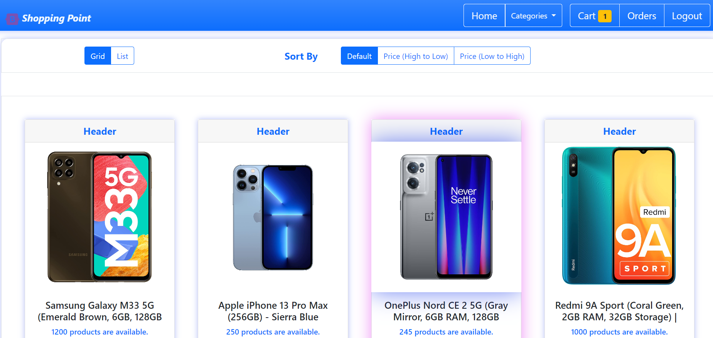
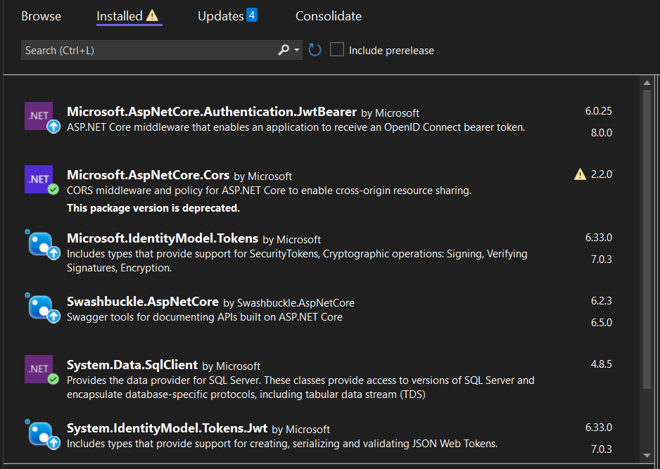

# MY FINAL PROJECT CF50
#### Video Demo:  <https://youtu.be/WGcEOzRyXK4>
#### Description:


<h1 style="color:#87CEEB;">This is my final project - web application like online store</h1>



<br/>

## Developed by: `Piotr Sviryd` 

<br/>
<br/>

## ***Technologies:***

- ***UI portion: Angular 14 and Bootstrap 5.***

- ***API portion: ASP.NET core 6.***

- ***For storage: Microsoft SQL Server 2018.***

<br/>
<br/>

User can create accaunt and login to web app. From main page we can select needed produc or add this to cart. From header we can choose product-category and navigate to needed page. In the productscategory page user can sort products by hight price or low, shoose list or grid view all products.
When user click to needed product system navigate to product ocmponent and show all info. Here user can select a bit more images, read a bit more description about product and also read and add comment about product. Only logined users can add new reviews. Also user can add product to his cart.
If we navigate to car we can see all info about have added products like: discount, count, total price and also last viewed products. User can remove not needed product from cart. If we click green button 'Order' we will navigate to other component like order.
In the order component we can select payment method and pay product.

<br/>
<br/>

<h3 style="color:#87CEEB;">Folder components structure for Angular:</h3>

``` ts
client
+-- login       'component for login user'
+-- register    'component for register user'
+-- cart        'component for work with cart'
+-- order       'component for order and work added products'

core
+-- footer          'footer component'
+-- header          'component for heder with navigation function'
+-- home            'main component'
+-- page-not-found  'component if user enter not valid url address'

product
+-- product             'conponent with product'
+-- product-details     'component with details selected product'
+-- products            'component with list of products'
+-- suggested-products  'component with product for order'

shared
+-- models          'models'
|   +-- navigation
|   +-- product
|   +-- cart
|   +-- payment
|   +-- order
|   +-- user
+-- services        'services'
    +-- navigation
    +-- utility
```

<br/>
<br/>

<h3 style="color:#87CEEB;">NuGet packages for .net</h3>



<br/>
<br/>

<h3 style="color:#87CEEB;">For database execute next scripts:</h3>

* `DB_Script_FillingData_Only.sql`
* `DB_Script_Schema_Only.sql`

